  <picture>
    <source media="(prefers-color-scheme: dark)" srcset="assets/hero-dark.svg">
    
  </picture>

## Hey, I'm Samuele

**Fullstack developer** with a strong preference for the **backend** — I'm way more at home dealing with APIs, microservices, and databases than fighting with CSS.

When I'm not writing code, I'm probably tinkering with my homelab or wondering why a service won't start.

  <picture>
    <source media="(prefers-color-scheme: dark)" srcset="https://raw.githubusercontent.com/1brecane/1brecane/output/github-snake-dark.svg">
    
  </picture>

  <picture>
    <source media="(prefers-color-scheme: dark)" srcset="assets/footer-dark.svg">
    
  </picture>

---

[`samueleruaro.com`](https://samueleruaro.com) &nbsp;·&nbsp; [`linkedin`](https://www.linkedin.com/in/samuele-ruaro-145251307/) &nbsp;·&nbsp; [`email`](mailto:samueleruaro@gmail.com)

📍 Verona, Italy

