  

## Hey, I'm Samuele

**Fullstack developer** with a strong preference for the **backend** — I'm way more at home dealing with APIs, microservices, and databases than fighting with CSS.

When I'm not writing code, I'm probably tinkering with my homelab or wondering why a service won't start.

  <picture>
    <source media="(prefers-color-scheme: dark)" srcset="https://raw.githubusercontent.com/1brecane/1brecane/output/github-snake-dark.svg">
    
  </picture>

---

  
  
  
    
  📍 Verona, Italy

